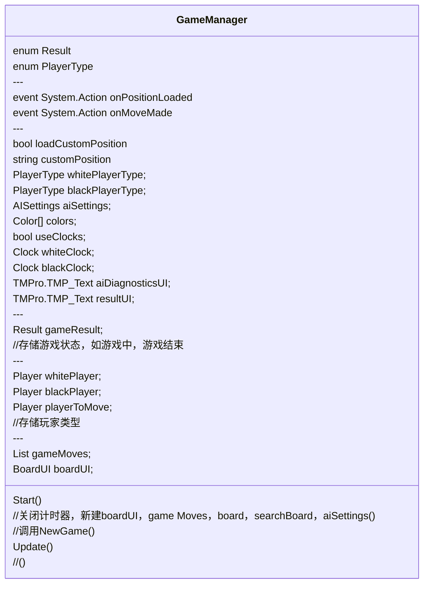

```mermaid
    classDiagram
    class GameManager{
        enum Result
        enum PlayerType
        ---
        event System.Action onPositionLoaded
        event System.Action onMoveMade
        ---
        bool loadCustomPosition
        string customPosition
        PlayerType whitePlayerType;
        PlayerType blackPlayerType;
        AISettings aiSettings;
        Color[] colors;
        bool useClocks;
        Clock whiteClock;
        Clock blackClock;
        TMPro.TMP_Text aiDiagnosticsUI;
        TMPro.TMP_Text resultUI;
        ---
        Result gameResult;
        //存储游戏状态，如游戏中，游戏结束
        ---
        Player whitePlayer;
        Player blackPlayer;
        Player playerToMove;
        //存储玩家类型
        ---
        List<Move> gameMoves;
        BoardUI boardUI;
        
        Start()
        //关闭计时器，新建boardUI，game Moves，board，searchBoard，aiSettings()
        //调用NewGame()
        Update()
        //()
    }
```